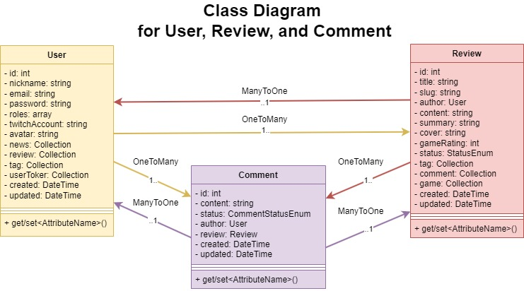
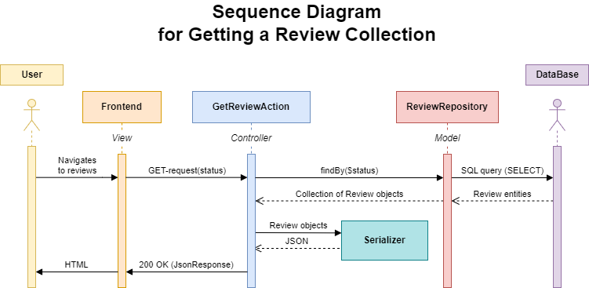
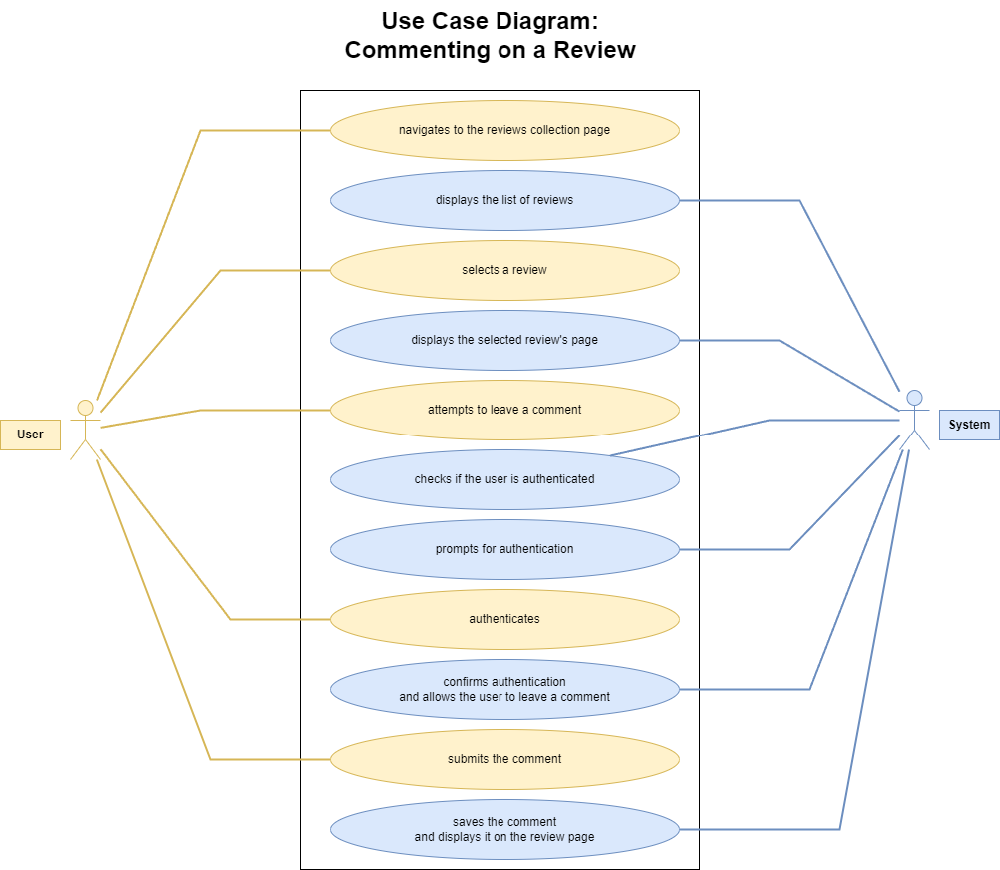
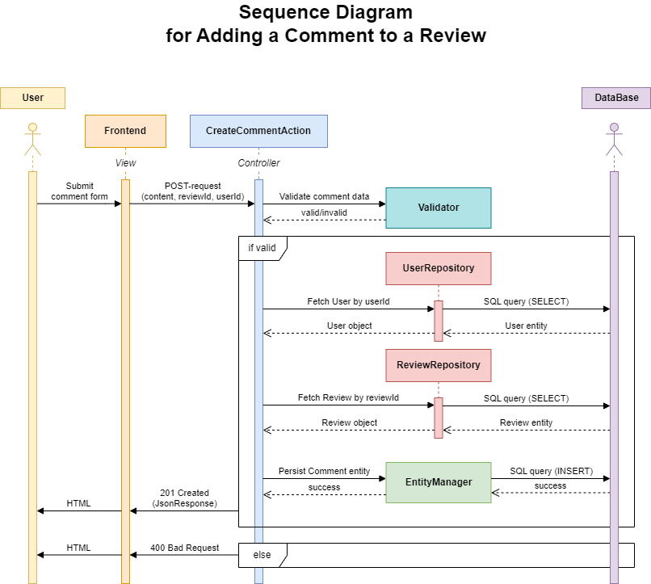

# Architecture Diagrams

This document contains the current exported diagrams for Grem.

## Class Diagram

Source image: [img/class-diagram.jpg](img/class-diagram.jpg)

## Review Collection Sequence Diagram

Source image: [img/review-collection-sequence-diagram.png](img/review-collection-sequence-diagram.png)

## Comment Use Case Diagram

Source image: [img/comment-use-case-diagram.png](img/comment-use-case-diagram.png)

## Comment Posting Sequence Diagram

Source image: [img/comment-sequence-diagram.png](img/comment-sequence-diagram.png)
