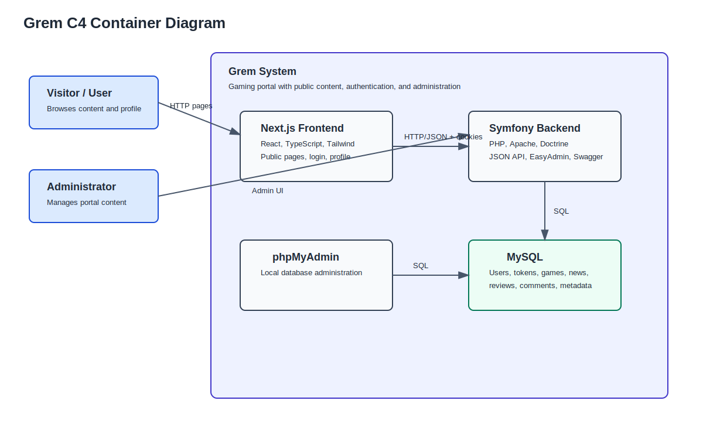
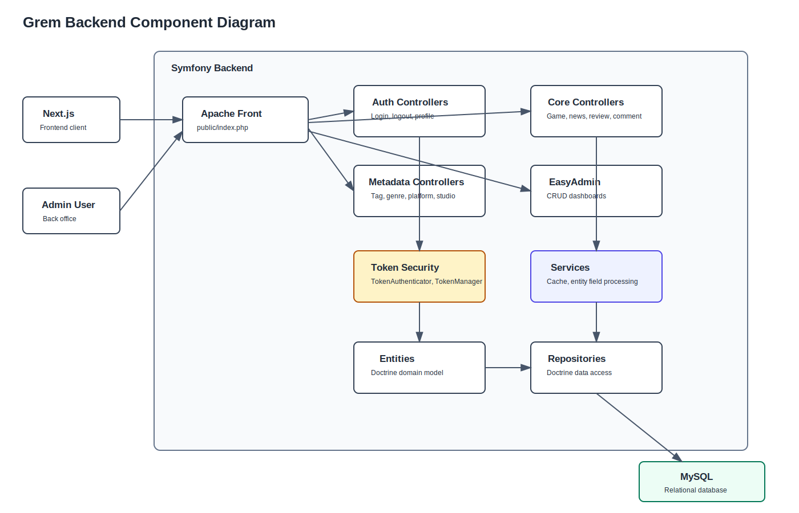
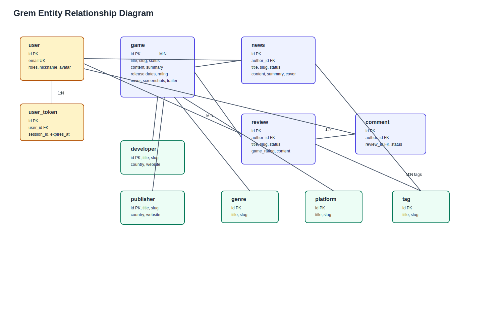

# Architecture Diagrams

This document links to exported Grem architecture diagrams.

Editable Mermaid sources are stored in [diagrams](diagrams/).

## C4 Container Diagram

PNG export: [img/c4-container.png](img/c4-container.png)

## Backend Component Diagram

PNG export: [img/c4-component.png](img/c4-component.png)

## Entity Relationship Diagram

PNG export: [img/erd.png](img/erd.png)

