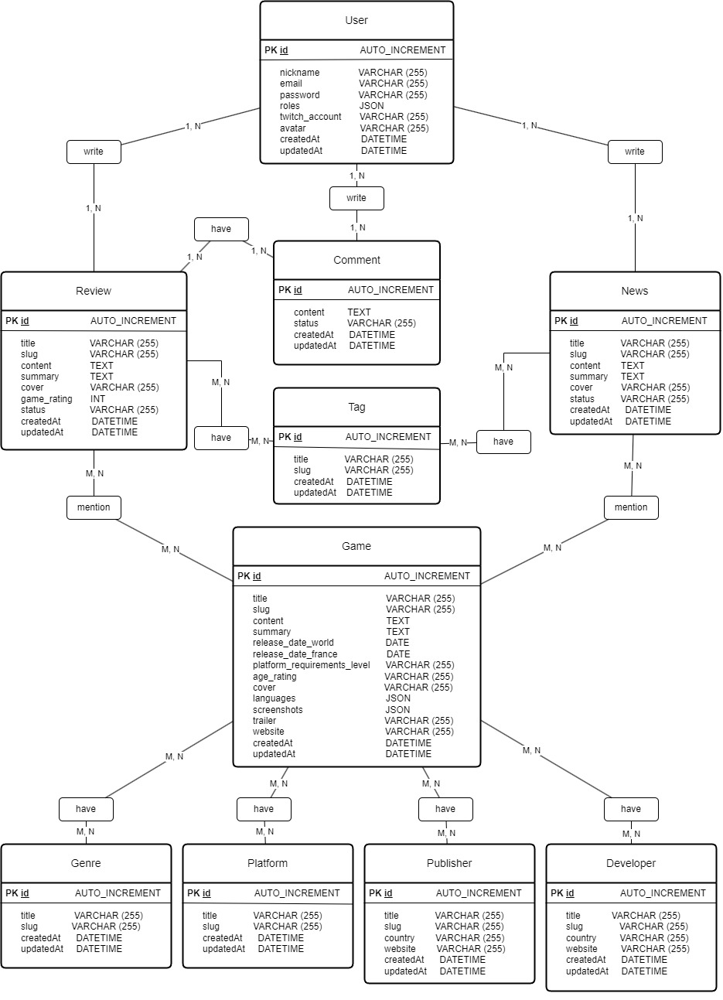

# Data Model

This document describes the relational data model of the Grem backend.

The database is a normalized MySQL schema managed through Doctrine ORM and migrations. Many-to-many relationships are expressed through junction tables.

## Entity Relationship Diagram

## Tables

### user

Stores registered users, credentials, roles, nickname, optional Twitch account, avatar, and timestamps.

### user_token

Stores authenticated session tokens. Each token belongs to one user and contains a `session_id`, JWT string, expiration date, and revocation flag.

### game

Stores game catalog entries with publication status, slug, content, summary, release dates, rating metadata, media fields, and external links.

### news

Stores news articles. A news record can have an author, tags, and related games.

### review

Stores reviews. A review can have an author, tags, related games, rating, comments, and media.

### comment

Stores comments attached to reviews. A comment can have an optional author and moderation status.

### tag

Stores tags used by news and reviews.

### genre

Stores game genres.

### platform

Stores platforms used by games.

### developer

Stores game developer studios with optional country and website.

### publisher

Stores game publishers with optional country and website.

## Junction Tables

### game_news

Many-to-many relationship between games and news.

### game_review

Many-to-many relationship between games and reviews.

### game_developer

Many-to-many relationship between games and developers.

### game_publisher

Many-to-many relationship between games and publishers.

### game_genre

Many-to-many relationship between games and genres.

### game_platform

Many-to-many relationship between games and platforms.

### news_tag

Many-to-many relationship between news and tags.

### review_tag

Many-to-many relationship between reviews and tags.

## Relationship Summary

- user -> news (1:N, author)
- user -> review (1:N, author)
- user -> comment (1:N, author)
- user -> user_token (1:N)
- review -> comment (1:N)
- game <-> news (M:N via game_news)
- game <-> review (M:N via game_review)
- game <-> developer (M:N via game_developer)
- game <-> publisher (M:N via game_publisher)
- game <-> genre (M:N via game_genre)
- game <-> platform (M:N via game_platform)
- news <-> tag (M:N via news_tag)
- review <-> tag (M:N via review_tag)

