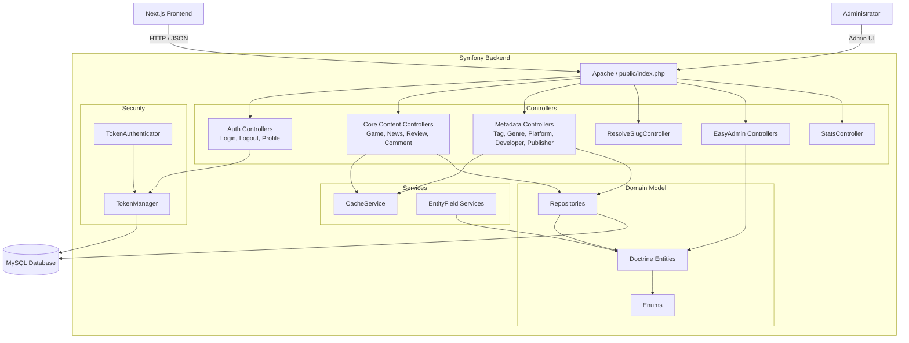

# Backend Component Diagram

```mermaid
flowchart TB
    frontend["Next.js Frontend"]
    adminUser["Administrator"]

    subgraph backend["Symfony Backend"]
        apache["Apache / public/index.php"]

        subgraph controllers["Controllers"]
            auth["Auth Controllers<br/>Login, Logout, Profile"]
            core["Core Content Controllers<br/>Game, News, Review, Comment"]
            meta["Metadata Controllers<br/>Tag, Genre, Platform, Developer, Publisher"]
            resolve["ResolveSlugController"]
            admin["EasyAdmin Controllers"]
            stats["StatsController"]
        end

        subgraph security["Security"]
            tokenAuth["TokenAuthenticator"]
            tokenManager["TokenManager"]
        end

        subgraph domain["Domain Model"]
            entities["Doctrine Entities"]
            repositories["Repositories"]
            enums["Enums"]
        end

        subgraph services["Services"]
            cache["CacheService"]
            fieldManager["EntityField Services"]
        end
    end

    db[("MySQL Database")]

    frontend -->|"HTTP / JSON"| apache
    adminUser -->|"Admin UI"| apache
    apache --> auth
    apache --> core
    apache --> meta
    apache --> resolve
    apache --> admin
    apache --> stats

    auth --> tokenManager
    tokenAuth --> tokenManager
    core --> cache
    meta --> cache
    core --> repositories
    meta --> repositories
    admin --> entities
    fieldManager --> entities

    repositories --> entities
    repositories --> db
    tokenManager --> db
    entities --> enums
```

