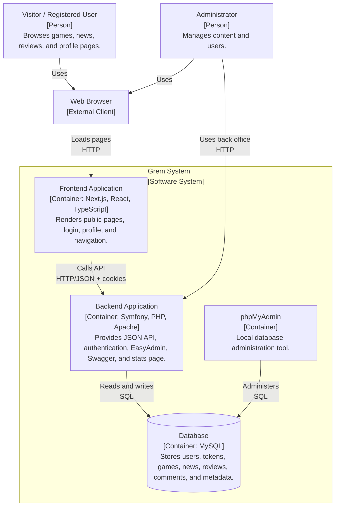

# Container Diagram

```mermaid
flowchart TB
    user["Visitor / Registered User<br/>[Person]<br/>Browses games, news, reviews, and profile pages."]
    admin["Administrator<br/>[Person]<br/>Manages content and users."]

    subgraph system["Grem System<br/>[Software System]"]
        frontend["Frontend Application<br/>[Container: Next.js, React, TypeScript]<br/>Renders public pages, login, profile, and navigation."]

        backend["Backend Application<br/>[Container: Symfony, PHP, Apache]<br/>Provides JSON API, authentication, EasyAdmin, Swagger, and stats page."]

        db[("Database<br/>[Container: MySQL]<br/>Stores users, tokens, games, news, reviews, comments, and metadata.")]

        phpmyadmin["phpMyAdmin<br/>[Container]<br/>Local database administration tool."]
    end

    browser["Web Browser<br/>[External Client]"]

    user -->|"Uses"| browser
    admin -->|"Uses"| browser
    browser -->|"Loads pages<br/>HTTP"| frontend
    frontend -->|"Calls API<br/>HTTP/JSON + cookies"| backend
    admin -->|"Uses back office<br/>HTTP"| backend
    backend -->|"Reads and writes<br/>SQL"| db
    phpmyadmin -->|"Administers<br/>SQL"| db
```

