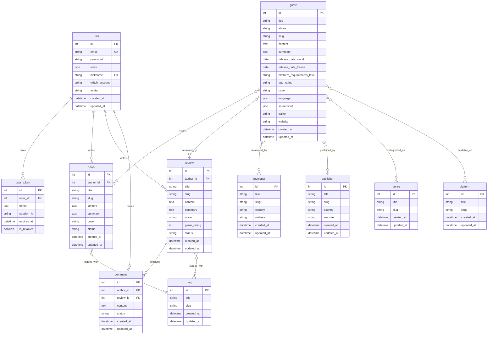

# Entity Relationship Diagram

```mermaid
erDiagram
    user {
        int id PK
        string email UK
        string password
        json roles
        string nickname UK
        string twitch_account
        string avatar
        datetime created_at
        datetime updated_at
    }

    user_token {
        int id PK
        int user_id FK
        text token
        string session_id
        datetime expires_at
        boolean is_revoked
    }

    game {
        int id PK
        string title
        string status
        string slug
        text content
        text summary
        date release_date_world
        date release_date_france
        string platform_requirements_level
        string age_rating
        string cover
        json language
        json screenshot
        string trailer
        string website
        datetime created_at
        datetime updated_at
    }

    news {
        int id PK
        int author_id FK
        string title
        string slug
        text content
        text summary
        string cover
        string status
        datetime created_at
        datetime updated_at
    }

    review {
        int id PK
        int author_id FK
        string title
        string slug
        text content
        text summary
        string cover
        int game_rating
        string status
        datetime created_at
        datetime updated_at
    }

    comment {
        int id PK
        int author_id FK
        int review_id FK
        text content
        string status
        datetime created_at
        datetime updated_at
    }

    tag {
        int id PK
        string title
        string slug
        datetime created_at
        datetime updated_at
    }

    genre {
        int id PK
        string title
        string slug
        datetime created_at
        datetime updated_at
    }

    platform {
        int id PK
        string title
        string slug
        datetime created_at
        datetime updated_at
    }

    developer {
        int id PK
        string title
        string slug
        string country
        string website
        datetime created_at
        datetime updated_at
    }

    publisher {
        int id PK
        string title
        string slug
        string country
        string website
        datetime created_at
        datetime updated_at
    }

    user ||--o{ user_token : owns
    user ||--o{ news : writes
    user ||--o{ review : writes
    user ||--o{ comment : writes
    review ||--o{ comment : receives

    game }o--o{ news : relates
    game }o--o{ review : reviewed_by
    game }o--o{ developer : developed_by
    game }o--o{ publisher : published_by
    game }o--o{ genre : categorized_as
    game }o--o{ platform : available_on
    news }o--o{ tag : tagged_with
    review }o--o{ tag : tagged_with
```

